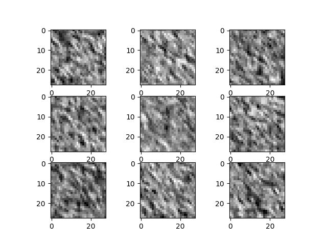

# GAN for MNIST

## Get started

To get started after cloning the repository you just need to type the following command and
you can play with GANs and see how it trains and how it outputs change.

````
pip install -r requirements
````

## Run it

just type the following in your command line

````
python start.py
````

## Output

#### Untrained Output (3x3)

